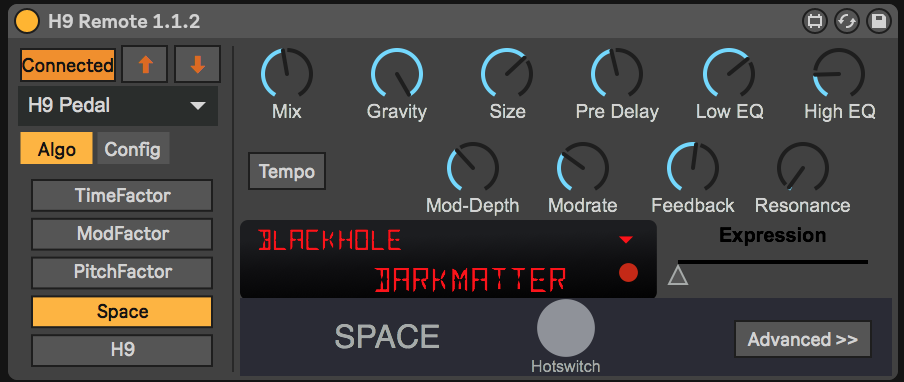
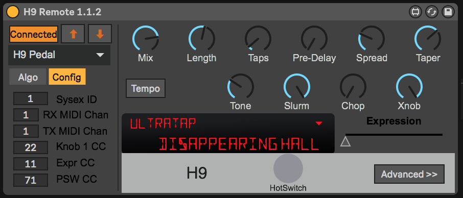
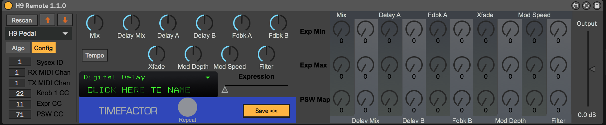

H9 Remote v 1.1
=================

Copyright 2018. Use of this software, the provided plugin, and any additional resources provided, unless listed below under "Credit", is permitted under the conditions of the [Creative Commons Attribution-NonCommercial-ShareAlike](https://creativecommons.org/licenses/by-nc-sa/4.0/) license. All other rights are reserved.

*Eventide and the Eventide logo are a registered trademark of Eventide, Inc.  The names of various algorithms may also be trademarks or registered trademarks of Eventide Inc., and are referenced herein for compatibility and interoperability only.*

*This software is not produced by, nor affiliated in any way with, Eventide Inc. Please direct all issues or feature requests through this github page.*

# Description

The H9 Remote is a Max For Live (M4L) Audio Effect plugin which can control an attached H9 stompbox in real time, supporting Ableton Live's automation and MIDI mapping and enabling saving the pedal preset state in a Live set or Live preset for future recall, even if the pedal has been completely reprogrammed in the meantime.

*Note: This plugin processes no audio directly. It only controls an attached H9.*

Basic features include:

* Fully supports all 5 modules (TimeFactor, ModFactor, PitchFactor, Space, and H9) and all 49 algorithms currently implemented in the H9 Max.
* Does not need the device to contain the required preset - can set any available algorithm and module directly.
* Operates entirely independently of the device's preset list - Does not overwrite any presets on the device.
* Supports Ableton M4L presets, so can store a completely separate set of presets than what is on the device.
* Saves the device configuration in the preset - no accidentally configuring the wrong H9 if you have multiple pedals.
* Receives and transmits knob, expression, and hotswitch changes from the pedal, for track automation recording, live performance, etc.
* Supports 14-bit precision MIDI CC values for primary knobs (currently using only 10 bits of total precision though)
* Supports Push and Live MIDI mapping to extend the controls for your H9 into the physical realm.
* Remembers which H9 each instance of the plugin was connected to, and restores the saved configuration from your Live set on open - ensuring your project re-opens with the right effects on the right pedal automatically, even if you didn't save the pedal configs as a preset.
* Allows you to send and automate expression controls even if you don't have an expression pedal connected.
* Supports multiple plugin instances connected to the same H9 using intelligent auto-enable/disable.
* Supports multiple H9s on separate instances, too. 

**Note:** For the optimal experience, this plugin makes use of the [DSEG14 font family](https://github.com/keshikan/DSEG) and [Dotrice](https://fontlibrary.org/en/font/dotrice). Please download and install those families to see the LCD in a slightly-closer match to the actual Factor and H9 stompbox displays.

Things that are not supported:

* Any controls other than the 10 knobs, the epxression pedal, and the "performance switch" (repeat/freeze/hotswitch). E.g. the looper functionality or pedal bypass.
* Turning your H9 Core or Standard into a Max (unless you own a Max already in which case your Core's additional algorithms will be automatically unlocked once you connect the Core or Standard to your account).
* Auto-configuration of your H9.
* Routing your audio to and from the H9.

# Compatibility and Credit

H9 Remote is compatible with Ableton Live 9 and 10. No guarantees are made of compatiblity with any other version, although it might work.
It has only been tested on Mac, and no guarantee of compatiblity with Windows is offered nor is planned to be.

A basic understanding of MIDI, channels, CC numbers, and device configuration/operation is assumed. This is not a tutorial.

The H9 Remote includes the imp.MIDI toolkit from The Impersonal Stereo (https://www.theimpersonalstereo.com/max-externals/) with gratefulness to David Butler. No ownership of this external is in any way implied or asserted.

# H9 Configuration

Before the plugin can correctly connect to your H9, you must set a few parameters on the H9 itself. Unfortunately, some of them cannot be configured through the iPod/Android App or the H9 Control software, but must be configured directly on the device.

Using the [H9 User Guide](https://www.eventideaudio.com/downloader/28), page 31 explains how to enter System Mode, and the following pages explain how to navigate through these modes. The necessary settings are entirely under the MIDI menu and are as follows:

- [RCV CH] : Set this to whatever MIDI channel you want. If you'll be using this H9 via USB, you can set this to 1, but if you'll be using it over DIN MIDI you'll need to ensure that this channel is unique to this device.
- [XMT CH] : Ideally this should be set to the same thing as RCV CH. Only make them different if you are dead certain you know what you're doing.
- [RCV.CTL] : This sets up the H9 to receive the knob and expression changes from the remote. Set up as follows:
  - [PSW] : 71 (or choose your own value, but you'll need to manually configure the plugin then)
  - [EXP] : 11 (the default MIDI CC for expression)
  - Ensure KB0-KB9 map to 22..31 - this is the default but if you or a previous owner customized these values, you'll need to set them back to this range, and sequential.
  - You can set the other controls to receive CCs as well, but as of v 1.0.0 the H9 Remote does not support them. It won't hurt anything, though.
- [XMT.CTL] : This sets up the H9 to send it's own Knob and Expression changes (e.g. when you use an attached physical expression pedal, the H9 Remote will track it and can send to Live's automation).
  - [PSW] : 71. Same as under [RCV.CTL]
  - [EXP] : 11.
  - Ensure KB0-KB9 map to 22..31 just as for the RCV.CTL settings.
  - You can set the other contorls to send CC as well, but as of v 1.0.0 the H9 Remote does not support them. It won't hurt anything though. Best to make sure these values match with the ones set in RVC.CTL.
- [XMT.PC] : Does not matter as far as the plugin is concerned, but OFF can prevent MIDI loops in some cases.
- [CTL.XMT] : Set to ON. This is essential.
- [PGM.XMT] : Set to ON. This may be supported in a near-future version.
- [SYS ID] : Leave at 1 unless you have more than one H9, then see the cautions under the following section "Multiple H9s".
- [OUTPUT] : Merge is generally safe, but the proper value here depends on if you're using DIN MIDI and what your routing looks like. You'll need to use your own judgement here.
- [CLK IN] : ON
- [CLK OUT] : Doesn't matter unless you want Live to follow the H9's tempo, then set this to ON.

With these settings, minimal configuration of the plugin will be necessary. If you have only one H9, you can skip straight on to the Plugin Configuration.

## Multiple H9s

If you have more than one H9, there are two important things to consider:

* Under USB: Each H9 must have a uniquely named MIDI port
* Under DIN MIDI: Each H9 must have a unique SysEx ID and MIDI channel.

### USB

If you are using USB for your H9 connectivity, you can go into the Mac OS's Audio Midi Setup utility, hit Command-2 if the Studio View of your devices isn't visible, and if your H9s are all connected and powered on, you should be able to quickly see each one. They will all be named "H9 Pedal" at this point. Click each one and hit the (i) icon in the toolbar to open the preferences. Give each of them a unique, short Device Name such as Guitar and Bass or MoogSynth1 and MoogSynth2 for series-connected units. Make sure you hit Apply. Now when the devices are enumerated, they will have a unique USB MIDI port name. No further configuration is needed - they can even be all on Channel 1 on this configuration.

### DIN MIDI

If you are using DIN MIDI and you are putting all of your H9s in series on the same physical MIDI I/O pair, you need to use a unique SysEx ID for each unit, and set a unique MIDI channel. Use the same channel for TX and RX unless you have a very specific reason not to. **NOTE: This can cause problems connecting the units with SysEx ID higher than 1 to the Eventide H9 Control software or apps. This is a known bug with their software, and is not a problem with your H9 or the H9 Remote.** To reconnect these units to H9 Control, just reset their individual SysEx ID to 1.

If you are using DIN MIDI but the devices are on different ports of a multi-port MIDI host (like the MOTU MIDI Express), you don't need to do anything! But if it helps, renaming the ports as mentioned in the USB section above will help you remember which one belongs to which unit.

# Plugin Configuration and Setup

Insert the plugin after powering on and connecting your H9 to your computer. The plugin will initially load in Live with no configuration and a default preset. This preset will not initially be transmitted to the H9. In order to establish communication between the plugin and your H9, you must do the following:

* Choose the right MIDI port in the dropdown. If the software successfully opens the port, the button that initially says "Rescan" will switch to "Connected". This does not mean it found an H9! It just means the MIDI port was opened and it can now send and receive MIDI data to that port.
* Ensure that the MIDI RX and TX channels match the configuration of your H9. If you left them at 1, then you should not need to change these at all.
* Ensure that the CC settings match the configuration you chose. If you followed the setup directions above, you should not need to change any of these either.
* If you set a custom SysEx id for the unit you wish to correspond with, set it here as well. Otherwise leave it at 1.

To test that the plugin is communicating with your H9, you can now press the "Up Arrow" icon to load the current state of your H9 into the plugin and synchronize. The plugin should update to reflect the chosen algorithm, preset name, and knob settings of your H9. If nothing happens, make sure your settings are correct, that you have chosen the right MIDI port, and that the link status box says "Connected". If you loaded the plugin before powering on your H9 you can either remove and re-insert the plugin, or try clicking the link status box to initiate a rescan of the MIDI ports, then select the H9 when it appears.

# Basic Operation

Where to put the plugin really depends on your workflow:
* If you have a fixed studio setup where your H9(s) is/are in series with an instrument, e.g. your guitar or synth play directly into a pedalboard containing one or more H9s, and that's the setup for those H9s for the Live session you're working in, then it makes most sense to drop those in as audio effects on that instrument's primary audio channel.
* If you have the H9 in question on a sidechain on your mixing board or audio interface, such that you can route multiple effects through it, it makes the most sense to drop the H9 Remote plugin into a return channel, as if it were a sidechained audio effect in Live.
* If you are using the H9 as an external processor of an audio track or MIDI instrument in Live, you can treat it as either of the above cases, depending on if you are routing only that instrument through it or using it as an auxiliary effect.

In all cases, if you make use of your audio interface to re-route the signal through the H9, combining the H9 Remote with an External Audio Effect into an effects rack makes sense, as the unit then behaves much like the H9 would physically, in that audio in and out of the interface is routed directly through the H9, which is under control of the H9 Remote plugin immediately following the External Audio Effect.

**Note:** At present, the enable/disable feature of the plugin takes no effect. This will likely change in an upcoming version.

The general workflow when using this plugin is as follows:

* If the H9 currently has the effect you want to save in it, use the "Sync Up" button (the upward facing arrow) to LOAD the H9's configuration into the plugin. The knobs and algorithm will be updated to match the internal state of the H9, and any movement of the knobs will be reflected in the H9's settings and vice versa.
* If you wish to choose the setting via the plugin, flipping to the "Algo" page will display the list of modules (TimeFactor, ModFactor, PitchFactor, Space, and H9) from which the algorithms derive. Choosing the desired module will load the core algorithms available into the algorithm dropdown, just above the preset name. Clicking the algorithm menu will allow you to choose the desired algorithm, and from there you can adjust the knobs to your liking. The module and algorithm changes will automatically sync to the H9, but will not be saved as a preset on the device, nor will overwrite the current preset. They go in a special mode (Preset 0) called "working memory" which is a temporary configuration of the pedal intended for precisely this sort of use.
* If you have a previously saved preset, loading that preset will automatically push its settings to the pedal that it was previously saved with, again using the Preset 0 working memory to prevent overwriting any saved data on the pedal.

Once the pedal is configured, you can do any of the normal Live plugin tricks with it, such as:

* Recording or drawing automation for the knob and expression pedal values in your track.
* Controlling the knobs and expression settings from a Push (this is a good reason to have the plugin directly in the instrument track if your use and routing of the plugin makes sense).
* Using Live MIDI mapping to the knobs and expression control to utilize other effects (e.g. a MIDI LFO) or an external controller to manipulate those controls in real-time.

## Presets

It is important to distinguish between the pedal's stored Presets (the 99 presets which are in the pedal's internal memory) and the concept of "preset" in Ableton Live. In Live, a "preset" is a configuration of plugin parameters that can be re-applied to a given plugin to configure it in a consistent and repeatable way, and to organize those collections of parameters.

The H9 Remote plugin fully embraces the Ableton Live preset system, but does not integrate at all with the H9 preset system. It is important to realize that they are separate and wholly unrelated concepts. Thus, if you select a particular preset on your H9, you must synchronize the state into the H9 Remote plugin before the plugin will reflect the current state of the pedal. If you wish to recall those exact settings via the plugin in the future, you must save the Live set, in which case the plugin settings will be saved with the set. If you wish to store those settings separately for retrieval in, e.g. another Live set, save the settings as a Live preset using the top right icon of a floppy disk in the plugin view.

### Preset names

**Note:** Due to the difference between the H9's presets, the Live preset storage system, and the 'working memory' of the pedal, there are three distinct meanings for the term "preset name". To ensure consistency, you should at least comprehend the differences between these.

When you save or load a preset in Ableton Live, you are effectively working with a file on your local storage system. The preset name, in this case, is just the name of the file. Live does not provide a direct way for a given preset filename to link its name with any variable in the plugin. Conversely, the H9 pedal itself keeps an associated name with each preset (including Preset 0, the 'working memory' preset used by the H9 Remote). Because there is no direct connection between these two, you must manage both separately.

When you are inside the H9 Remote plugin, making changes to the knobs and choosing modules and algorithms, you are effectively building up a temporary preset in the working memory of the H9. Whenever you choose a new algorithm, to help ensure that things are synchronized, the name of the algorithm is stored as the name of the current temporary preset - thus if you choose the "Blackhole" algorithm on the Space module, you will see the H9 display "0.Blackhole". This shows that the current preset, number 0, is named "Blackhole" (which is the same as the algorithm currently in use).

Once you are satisfied with the sound of your preset, however, you may wish to give it a distinctive name - both to confirm on the pedal that it is in fact the preset you wish to load, and for convenience when reviewing the plugin state. By double-clicking inside the plugin name field on the H9 Remote you can edit the name of the plugin. Pressing the return key will send the name to the H9.

If you then save these settings as an Ableton Live preset, the name will be stored with the preset and will be recalled later to the pedal.

### Pedal presets

If you wish to store the current state of the H9 as a pedal preset for future offline use, simply store the preset using the pedal's own preset save function (H9 User Guide, page 18). The plugin will continue to use the Preset 0 for future algorithm changes and when reloading these exact settings later, but you will have saved a copy as a preset on the pedal itself for offline use without your computer and live set handy.

## Tempo Control

The time-based parameters of many algorithms can be synced to the MIDI clock in beat-values instead of milliseconds or seconds. To enable this for a given preset you need to turn on Tempo mode. Click the "Tempo" control to enable this. Please note that this requires a full preset reload as there is not presently a way to set this value aside from dumping the preset to the pedal. So turning this on and off will take slightly longer. This is a preset configuration value and is not able to be automated.

# Advanced Options

The H9 Remote offers an advanced panel for configuring additional options such as the output gain of the preset, and the knob expression pedal and performance switch mappings. Click the "Advanced >>" button to open this panel.

**Note:** Because these values must be saved using SysEx, they don't fully take effect until you sync the plugin state by either closing the panel (it will automatically sync) or by explicitly pressing the "sync down" arrow button. Read the sections below for more details. The primary control knobs are disabled while this panel is open to remind you that they are not currently taking effect. Any changes made to them via either the UI or by MIDI-mapped devices should update once the panel is closed; however it is advisable not to alter their settings while the panel is open for the most consistent results. 

## Expression mappings

The H9 offers the ability to map knob ranges to the motion of the expression switch, and to map a single alternate position of each knob to the performance switch parameter. This appears to apply only to algorithms which feature the HotSwitch feature, as the TimeFactor, PitchFactor, and ModFactor algorithms all have a specifically mapped purpose to this switch and thus do not treat it like a "HotSwitch".

Setting these mappings can be done in Eventide's own apps, via the pedal directly through a slightly arduous procedure, or, conveniently directly in the H9 Remote plugin. The expression max and min mappings refer to the "max" (full-toe) and "min" (full-heel) positions of the pedal, not to the values of the knobs. So you can for instance map a larger knob position to the "min" setting and a smaller knob position to the "max" setting so that the knob rotates counterclockwise as you move the pedal from heel to to (or the expression slider from left to right).

The expression pedal and performance switch mappings WILL UPDATE the parameter on the pedal in real-time while you are adjusting the mapping. This is so that you can see on the pedal the actual values for the position you are adjusting the mapping to. For instance, if you want the full toe-position expression pedal (EXP MAX) to be the INF delay value, it would be difficult to guess which of the available values on the dial this range maps to. But if we send the CC for you, it becomes quite simple to move the dial until the H9 displays "INF". But the knob values as displayed on the automation side of the plugin will be restored as soon as you save the preset state back to the pedal.

Because the H9 does not offer (at least, as currently documented by Eventide) a way to set these values via CC or SysEx, the preset must be fully dumped back to the device for these parameter mappings to take effect. By clicking on either the "Sync Down" arrow in the configuration section, or by clicking "Save <<" to close the advanced panel, the preset will be dumped. This will restore the knob values on the H9 to match the displayed knob values on the plugin, and will store the expression and performance switch mappings silently. The pedal can take a few seconds before fully recognizing these new parameters, so be patient with it.

## Output gain

Sometimes you find that the output gain necessary for unity gain is too low and your pedal is clipping. This happens a lot with the INF and FREEZE decay positions, and sometimes with heavy multitap delay or deep bass octaves. If you wish to set a lower (or higher) gain value for a given preset, just adjust the output gain slider and save the advanced settings to the pedal to commit your change. This control does NOT update in real time currently.

# Legal blah blah

This software comes with NO WARRANTY, including suitability for purpose, and by using this software you waive any and all claims against the author or his assignees for any consequences, real or imagined, arising from, out of, or in conjunction with, said use. The author disclaims all liability for use, proper or improper, of this software. Use at your own risk.
